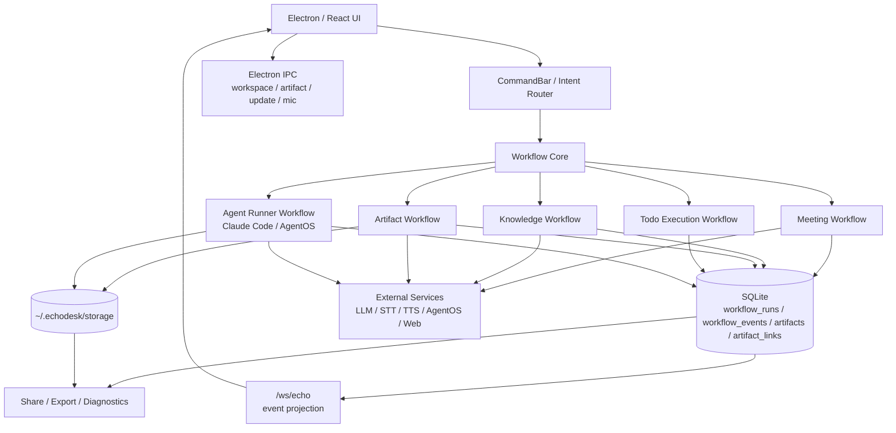
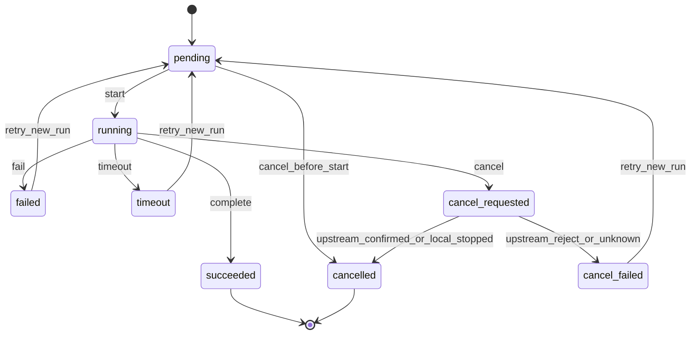

# EchoDesk 0.3 架构设计

日期：2026-07-09  
阶段：开发前架构确认  
基线：`v0.2.50` [F-ECHO-001]  

## 1. 设计目标

EchoDesk 0.3 把产品抽象为一个本地优先的 workflow 系统。[F-ECHO-002]

核心目标：

1. 所有长流程都有统一 run 记录。
2. 所有状态变化都有可 replay 的事件。
3. 所有产物都有持久 owner 和来源。
4. 会议、Todo、Artifact、Agent、分享、诊断不再各自维护临时状态。
5. Claude Code / AgentOS 作为正式 Agent Runner 纳入同一工作流。

## 2. 6W2H

| 维度 | 0.3 定义 |
|---|---|
| Who | 主要用户是需要本地会议记录、知识检索、办公产物和后台执行能力的桌面用户。 |
| What | 把会议、知识、任务、产物、分享归档连成可恢复 workflow。 |
| Where | Electron 桌面为主，Android/TV/Public Demo 作为受限入口保留。 |
| When | 会议中、会后整理、基于资料生成产物、交给 Agent 执行长任务时使用。 |
| Why | 0.2.50 已有能力，但产物关联、失败恢复、Agent 闭环和 contract 门禁不完整。 |
| How | 新增 Workflow Core，统一 DB、事件流、状态机和 UI 投影。 |
| How Much | 以 7 个 PR 切片完成，先后端核心，再 UI，再 contract gates。 |
| How Well | 重启可恢复、失败可重试、产物可追溯、事件可 replay、契约有测试。 |

## 3. 总体架构

## 4. Workflow Core

Workflow Core 是 0.3 的唯一长流程编排入口。

职责：

- 创建 `workflow_runs`。
- 写入 `workflow_events`。
- 驱动状态迁移。
- 暴露 replay API。
- 将领域事件投影到 `/ws/echo`。
- 绑定 artifacts 和 upstream task。
- 在重启后恢复未完成 run。

不做：

- 不直接调用 STT/LLM/TTS/AgentOS SDK。
- 不承载 UI 状态。
- 不决定具体 artifact 生成策略。
- 不直接读写用户文件正文。

## 5. 统一状态机

状态定义：

| 状态 | 含义 | 终态 |
|---|---|---|
| `pending` | 已创建，未开始执行 | 否 |
| `running` | 正在执行 | 否 |
| `cancel_requested` | 用户已请求取消，等待收口 | 否 |
| `succeeded` | 成功完成 | 是 |
| `failed` | 执行失败 | 是 |
| `timeout` | 超时收口 | 是 |
| `cancelled` | 确认取消 | 是 |
| `cancel_failed` | 取消失败或状态未知 | 是 |

## 6. 领域模块边界

| 模块 | 入口 | Owner | 依赖 |
|---|---|---|---|
| Workflow Core | `backend/app/workflows` | 后端 | repo, event bus |
| Meeting Workflow | `backend/app/use_cases/meeting_*` | 后端 | STT, diarizer, LLM, Workflow Core |
| Knowledge Workflow | RAG/workspace APIs | 后端 | RAG adapter, workspace scanner |
| Artifact Workflow | `/artifacts/*` | 后端 | skill runner, storage, Workflow Core |
| Todo Workflow | meetings minutes + artifact | 后端 | Workflow Core, Artifact Workflow |
| Agent Runner Workflow | `/agents/*` | 后端 | AgentOS, Workflow Core |
| UI Projection | `desktop/src/store.ts` | 前端 | `/ws/echo`, REST hydration |
| Desktop Local Capability | Electron preload/main | Electron | OS, filesystem, shell |

## 7. 数据 Owner

| 数据 | Owner | 0.3 规则 |
|---|---|---|
| workflow run | backend SQLite | 所有长流程必须创建 |
| workflow event | backend SQLite | 所有状态变化必须追加 |
| artifact metadata | backend SQLite | 所有产物必须登记 |
| artifact file | backend storage | 文件在 storage，DB 只保存路径和元数据 |
| meeting artifact link | backend SQLite | 不再只靠前端内存 |
| todo execution link | backend SQLite | Todo 状态从 workflow 投影 |
| Agent runner task id | backend SQLite | EchoDesk task 与 upstream task 分离 |
| UI current view | frontend store | 可丢失，不作为事实源 |
| workspace directory grant | Electron/user config | 必须显式授权 |

## 8. Contract 原则

REST：

- 任何新增 route 必须进入 route snapshot。
- 任何删除 route 必须更新 0.3 文档和测试。

WebSocket：

- `/ws/echo` 是唯一主线。
- Workflow events 通过 `workflow.event` 或既有领域事件投影。
- Agent runner raw event 不直接暴露给 UI。

IPC：

- preload 暴露、main handler、renderer wrapper 三边必须对账。
- 新增本地能力必须写安全边界。

## 9. UI 信息架构

0.3 UI 不重做视觉系统，只重构信息归属。

Must：

- 当前会议状态。
- 当前正在执行的 workflow。
- 产物列表。
- 失败和可重试入口。
- Agent 任务状态。

Should：

- Workflow 历史。
- 单个 run 的事件时间线。
- 产物来源和关联会议。

Could：

- Agent runner 详细日志折叠区。
- 分享前产物选择器。

Deferred：

- 多用户协作权限。
- 云端同步 workflow。

## 10. 架构完成标准

0.3 架构完成必须满足：

- `GET /meetings/{id}/artifacts` 返回真实持久化数据。
- Todo 执行不依赖前端内存。
- Agent task 写入统一 workflow。
- Agent 产物进入统一 artifact。
- outputs UI 只做投影，不承担事实源。
- contract tests 能阻止 route、WS、IPC 漂移。
