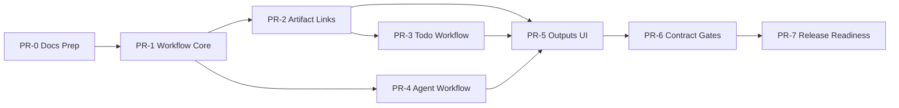

# EchoDesk 0.3 开发计划

日期：2026-07-09  
状态：冻结的历史计划，不作为当前实现或验收真源
基线：`v0.2.50` [F-ECHO-001]  

## 1. 开发原则

0.3 开发遵守：

1. 先架构和测试设计，再实现。
2. 每个 PR 只推进一个 workflow 切片。
3. 所有长流程必须进入 Workflow Core。
4. Claude Code / AgentOS 是正式 Agent Runner，不再作为散落补丁。
5. 任何 UI 状态都必须能从后端事实源 hydrate。
6. 新增 contract 必须有 snapshot。

## 2. 版本策略

| 阶段 | 版本 |
|---|---|
| 文档准备 | 不 bump runtime version |
| Workflow Core 首个实现 PR | `0.3.0-alpha.1` |
| Artifact/Todo 闭环 | `0.3.0-alpha.2` |
| Agent Workflow 闭环 | `0.3.0-alpha.3` |
| UI 和 contract gates | `0.3.0-beta.1` |
| 发布候选 | `0.3.0-rc.1` |

## 3. PR 拆分

### PR-0：0.3 文档与开发前准备

范围：

- `docs/0.3/*`
- FactStore 初始化。
- README 入口。
- 不改业务代码。

完成标准：

- 0.3 文档包完整。
- FactStore health-check 通过。
- `git status` 中能清楚看到仅文档和治理准备。

### PR-1：Workflow Core

范围：

- DB migration：`workflow_runs`、`workflow_events`、`artifact_links`。
- `WorkflowService`。
- workflow DTO/schema。
- `/workflows/runs*` 基础 API。
- event bus projection。

完成标准：

- 单测覆盖状态迁移、event replay、raw hash 去重。
- migration 可在旧 DB 上重复运行。
- 无 UI 改动或仅隐藏入口。

风险：

- migration 失败会阻塞启动。
- 需要避免与现有 `agent_tasks` 表冲突。

### PR-2：Artifact 持久关联

范围：

- artifact metadata 持久化。
- `artifact_links` 写入。
- `/artifacts` 列表从 DB 返回。
- `GET /meetings/{id}/artifacts` 改为真实查询。
- clear outputs 只处理会议关联产物。

完成标准：

- 重启后 artifact 仍在。
- 分享页可读 linked artifacts。
- 旧 artifact 无关联时不误归属。

风险：

- 旧 SkillExecutor 只写文件，需要补 metadata 写入点。
- 会议产物历史数据不能强行猜测。

### PR-3：Todo Workflow

范围：

- Todo 执行创建 workflow run。
- Todo 状态从 workflow 投影。
- 成功后写 artifact link。
- 失败后可 retry。
- `MinutesView` UI 状态更新。

完成标准：

- Todo 执行中、成功、失败、重试可见。
- 重启后状态不丢。
- 旧 minutes JSON 兼容。

风险：

- `minutes_json` 旧结构复杂。
- 同一 Todo 并发点击需要锁。

### PR-4：Agent Runner Workflow

范围：

- `/agents/tasks` 内部转为 workflow run。
- Agent task event 写入 workflow_events。
- Agent 产物导入 artifacts。
- cancel/timeout/retry 完整状态。
- 兼容旧 AgentTask DTO。

完成标准：

- 无 grant、grant、submit、running、complete、failed、cancel、timeout 都有测试。
- Mock AgentOS 集成测试通过。
- Agent 产物进入统一 outputs。

风险：

- 旧 `agent_tasks` 表迁移策略需要谨慎。
- 上游 AgentOS 事件格式可能变化。

### PR-5：Outputs UI 重构

范围：

- outputs 分区：任务、产物、失败。
- 普通 artifact 和 Agent artifact 统一卡片模型。
- 失败卡片接真实 retry。
- Agent 卡片支持取消、重试、错误详情。

完成标准：

- 用户能在 5 秒内区分任务/产物/失败。
- 所有按钮有真实后端动作。
- Playwright 覆盖关键路径。

风险：

- 当前 `ArtifactPanel` 较大，拆分时避免顺手大重构。

### PR-6：Contract Gates

范围：

- REST route snapshot。
- WS event snapshot。
- IPC snapshot。
- script matrix test。
- 0.3 workflow scenario tests。

完成标准：

- 删除 route/event/IPC/script 会让测试失败。
- README/治理文档说明 PR 必跑门禁。

风险：

- snapshot 初版容易过宽，必须只锁产品 contract。

### PR-7：Release Readiness

范围：

- version bump 到 `0.3.0-beta.1` 或 `0.3.0-rc.1`。
- CHANGELOG。
- install/release docs 更新。
- packaged smoke。

完成标准：

- `version:check` 通过。
- desktop build 通过。
- backend pytest 通过。
- release asset 命名更新。

## 4. 任务依赖

## 5. 开发节奏

建议节奏：

- 每个 PR 控制在 1 到 2 天。
- 后端 schema 和 service 先于 UI。
- 每个 PR 都必须有可运行测试。
- UI PR 必须有截图或录屏。
- Agent PR 必须使用 Mock AgentOS，不依赖真实服务才能通过 CI。

## 6. 每阶段 DoD

Backend DoD：

- type/schema 明确。
- migration 幂等。
- repository 层有单测。
- API 有 happy/sad 测试。
- 错误不吞。

Frontend DoD：

- state owner 清楚。
- loading/error/empty/success 全状态。
- 破坏性操作 Modal 确认。
- 按钮不只是 console.log。
- Playwright 覆盖主路径。

Agent DoD：

- full access 保留。
- 授权事件可 replay。
- submit/cancel/retry/timeout 可追踪。
- 上游断线不假成功。
- 产物统一归档。

Release DoD：

- 版本一致。
- CHANGELOG 更新。
- install docs 更新。
- packaged smoke 有结果。

## 7. 不确定项处理

开发中遇到以下情况必须回到架构文档确认：

- 是否要改变 public demo 默认行为。
- 是否要删除旧 `agent_tasks` 表。
- 是否要引入云端同步。
- 是否要改变 `/ws/echo` 协议主路径。
- 是否要让 Android/TV 承担 Agent Workflow。

## 8. 首个开发任务

PR-1 的第一步：

1. 新增 migration 文件。
2. 新增 `backend/app/workflows`。
3. 写 `WorkflowRun` / `WorkflowEvent` schema。
4. 写状态迁移单测。
5. 再实现 service。

开发前不要先改 UI。
