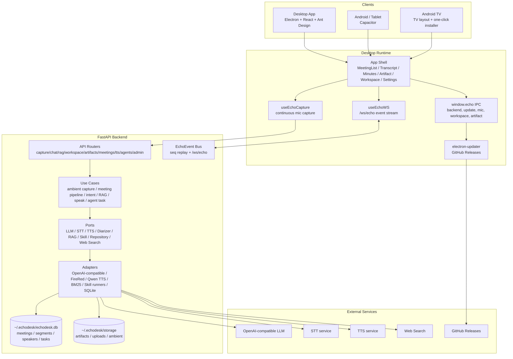

# EchoDesk v0.2.50 主线治理规范

日期：2026-07-09  
基准：`v0.2.50` / `e5574e9379e82f10057d5c84f401349c6f8e613b`  
状态：Canonical baseline。`0.2.7` 线不再作为 EchoDesk 主线解释或继承。

## 0. 基准裁决

本仓库治理从现在起以 `v0.2.50` 为准。

约束：

1. `desktop/package.json`、`backend/app/__init__.py`、README、Release 文档必须一致指向 `0.2.50`。
2. 任何来自旧 `0.2.7`/heyi/ESP32/agent 实验线的代码，不允许直接混入主线。
3. 若要重新引入实验线能力，必须先写 ADR，说明产品模式、数据 owner、交互契约、测试门禁和发布影响。
4. `ARCHITECTURE.md`、本文和 README 的架构口径冲突时，以本文为治理裁决入口，再回写架构文档。
5. 主线产品目标是 EchoDesk public demo/release：会议、持续采集、知识库、产物、桌面/Android/TV、更新和诊断。

一句话架构：

EchoDesk v0.2.50 是一个“会议 + 办公数字分身”公开发行应用：Electron/React 负责用户体验和本地能力，FastAPI 负责会议/RAG/产物/Agent 编排，外部模型服务提供 STT/LLM/TTS，发布链覆盖 macOS、Windows、Linux、Android 和 TV。

## 1. 产品架构



## 2. 功能清单

### 2.1 桌面 Shell

| 功能 | 用户入口 | 代码入口 | 状态 | 治理要求 |
|---|---|---|---|---|
| 主布局 | Header + Meeting sidebar + Transcript + Minutes/Artifact pane | `desktop/src/App.tsx` | 主线 | 不得替换为聊天头像式 UI |
| 关于/版本 | 顶栏 `v{__APP_VERSION__}` | `AboutModal.tsx` | 主线 | frontend/backend version 必须可见 |
| 设置 | 顶栏设置按钮 | `SettingsPanel.tsx` | 主线 | 所有运行时配置必须归入 Settings |
| 更新提示 | 顶栏 update button | `App.tsx`, `runtime.ts` | 主线 | 发行版必须保留 |
| 状态条 | backend/TTS/mic/meeting 状态 | `StatusBar.tsx`, `MeetingStatusBar.tsx` | 主线 | 状态必须真实可诊断 |

### 2.2 持续采集

| 功能 | 用户入口 | 代码入口 | 状态 | 治理要求 |
|---|---|---|---|---|
| App 启动持续监听 | 自动 | `capture/useEchoCapture.ts` | 主线 | 不增加额外手动开关作为主路径 |
| PCM 转换 | 内部 | `capture/pcm.ts`, `audioCapture.ts` | 主线 | 采样率、格式必须有测试 |
| chunk 路由 | 内部 | `capture/captureChunkRouter.ts` | 主线 | capture 和 meeting 不得重复 STT |
| capture status | UI tag | `CaptureStatus.tsx` | 主线 | 错误态必须能指导用户处理 |
| 麦克风权限 | onboarding/status | `mic:*` IPC, `OnboardingModal.tsx` | 主线 | macOS 权限诊断必须保留 |

### 2.3 会议

| 功能 | 用户入口 | 代码入口 | 状态 | 治理要求 |
|---|---|---|---|---|
| 自动会议识别 | 后台 | `use_cases/auto_meeting_detector.py` | 主线 | 状态机必须可测试 |
| 会议状态 | 顶栏/列表 | `MeetingStatusBar.tsx`, `MeetingList.tsx` | 主线 | UI 以 backend state 为准 |
| 手动开始/结束 | API/UI | `/meetings/manual_start`, `/manual_end` | 主线 | 保留手动兜底 |
| 转写流 | 主界面 | `TranscriptStream.tsx` | 主线 | speaker/time/text 必须稳定 |
| 纪要生成 | Minutes pane | `MinutesView.tsx`, `meeting_pipeline.py` | 主线 | failed/retry/detail 必须保留 |
| 会后分享 | Share modal | `MeetingShareModal.tsx`, `/meetings/{id}/share` | 主线 | public demo 关键路径 |
| 待办 | Minutes todo | `MinutesView.tsx` | 主线 | todo 与 artifact task 关联必须有 schema |

### 2.4 知识库与 RAG

| 功能 | 用户入口 | 代码入口 | 状态 | 治理要求 |
|---|---|---|---|---|
| 工作区目录 | WorkspaceBar / Settings | `WorkspaceBar.tsx`, `SettingsPanel.tsx` | 主线 | 目录授权必须显式 |
| 本地扫描 | WorkspaceBar | `/workspace/scan`, `workspace_scanner.py` | 主线 | 扫描失败要可见 |
| 文档入库 | 文件上传/工作区 | `/rag/ingest` | 主线 | 文档 ID 和来源必须可追溯 |
| 文档列表/删除 | Workspace modal | `/rag/docs`, `DELETE /rag/docs/{id}` | 主线 | 删除要同步 UI |
| RAG 问答 | CommandBar | `/rag/ask`, `retrieve_and_answer.py` | 主线 | 答案必须带引用来源 |

### 2.5 Chat 与 Intent

| 功能 | 用户入口 | 代码入口 | 状态 | 治理要求 |
|---|---|---|---|---|
| CommandBar 文本输入 | CommandBar | `CommandBar.tsx` | 主线 | 不替换为简化 textarea |
| 附件上传 | CommandBar | file input + RAG ingest | 主线 | 附件进入知识库路径 |
| 快捷命令 | TV quick commands | `CommandBar.tsx` | 主线 | TV mode 必须可遥控操作 |
| intent route | 后端 | `/intent/route`, `intent_router.py` | 主线 | 新 intent 必须加 eval/test |
| chat answer | 后端 | `/chat`, `ask_question.py` | 主线 | streaming/非 streaming 契约要清楚 |

### 2.6 Artifact

| 功能 | 用户入口 | 代码入口 | 状态 | 治理要求 |
|---|---|---|---|---|
| 一键产物 | CommandBar/Minutes todo | `/artifacts/generate` | 主线 | 产物类型必须走 `GeneratedArtifact` |
| 产物列表 | ArtifactPanel | `ArtifactPanel.tsx` | 主线 | 不把产物只塞进聊天气泡 |
| 预览 | Preview modal | `ArtifactPreviewModal.tsx` | 主线 | markdown/txt/docx/xlsx/html 预览要保留 |
| 下载 | button/link | `/artifacts/{id}/download` | 主线 | release 包可用 |
| 系统打开 | preview button | `echo:open-artifact-in-system` IPC | 主线 | 桌面端关键能力 |
| 失败卡片 | ArtifactPanel | `failedArtifact.ts` | 主线 | retry/dismiss/error detail 保留 |

### 2.7 TTS

| 功能 | 用户入口 | 代码入口 | 状态 | 治理要求 |
|---|---|---|---|---|
| TTS toggle | 顶栏 | `App.tsx`, `useTtsPlayer.ts` | 主线 | toggle 不等于健康 |
| 真实健康 | StatusBar | `/tts/diag` | 主线 | 必须跑真实合成回环 |
| 合成 | API | `/tts/speak` | 主线 | silent output 必须报错 |
| 建议播报 | API/Event | `/tts/suggest`, `SpeakUseCase` | 主线 | 由前端决定是否播放 |

### 2.8 Agent Task

| 功能 | 用户入口 | 代码入口 | 状态 | 治理要求 |
|---|---|---|---|---|
| 创建任务 | Artifact/Command | `/agents/tasks` | 主线 | task 要有状态机 |
| 授权 Claude Code | Agent card | `/agents/grants/claude_code` | 主线 | 授权必须显式 |
| 任务事件 | Agent card | `/agents/tasks/{id}/events` | 主线 | 事件可 replay |
| Artifact 文件 | download/open | `/agents/tasks/{id}/artifacts/{path}` | 主线 | path 必须安全校验 |
| cancel/retry | Agent card | `/cancel`, `/retry` | 主线 | terminal state 幂等 |

### 2.9 Admin 与 Diagnostics

| 功能 | 用户入口 | 代码入口 | 状态 | 治理要求 |
|---|---|---|---|---|
| 数据目录 | Settings | `/admin/data-dir` | 主线 | 不暴露敏感值 |
| 导出会议 | Settings/share | `/admin/meetings/{id}/export` | 主线 | zip 文件名安全 |
| 重置说话人 | Settings | `/admin/speakers/reset` | 主线 | admin gate |
| 远端模型配置 | Settings | `/admin/settings/remote` | 主线 | secret mask |
| 诊断包 | Settings | `/admin/diagnostics/export` | 主线 | 用户排障关键路径 |

### 2.10 Release / Multi-platform

| 功能 | 用户入口 | 代码入口 | 状态 | 治理要求 |
|---|---|---|---|---|
| macOS DMG/zip | Release | `app:dist:mac` | 主线 | 每版必须产出 |
| Windows NSIS/zip | Release | `app:dist:win`, workflow | 主线 | 不能删除 |
| Linux AppImage/deb | Release | `app:dist:linux` | 主线 | 不能删除 |
| Android APK | Release | `app:dist:android` | 主线 | 若下线必须 ADR |
| Android TV | Release | `app:package:tv`, `tv:smoke` | 主线 | public demo 关键入口 |
| 更新 | App UI | electron-updater + GitHub Releases | 主线 | 更新状态必须 UI 可见 |

## 3. 交互契约

### 3.1 REST API

| 域 | 路径 | 说明 |
|---|---|---|
| meta | `GET /healthz` | 基础健康，desktop bootstrap 依赖 |
| meta | `GET /bootstrap` | `ws_url/http_url/app_version/features` |
| meta | `GET /healthz/full` | 完整探针 |
| capture | `POST /capture/chunk` | 持续采集音频 chunk |
| capture | `GET /capture/stats` | 采集统计 |
| capture | `GET /capture/recent` | 最近采集 |
| chat | `POST /chat` | 文本问答 |
| intent | `POST /intent/route` | 指令分类 |
| rag | `POST /rag/ingest` | 文档入库 |
| rag | `GET /rag/stats` | RAG 状态 |
| rag | `GET /rag/docs` | 文档列表 |
| rag | `DELETE /rag/docs/{doc_id}` | 删除文档 |
| rag | `POST /rag/ask` | 知识库问答 |
| workspace | `GET /workspace/status` | 工作区状态 |
| workspace | `POST /workspace/scan` | 扫描目录 |
| workspace | `POST /workspace/clear` | 清空索引 |
| workspace | `POST /workspace/add-dir` | 添加目录 |
| workspace | `POST /workspace/remove-dir` | 移除目录 |
| artifacts | `POST /artifacts/generate` | 生成产物 |
| artifacts | `GET /artifacts/{artifact_id}/download` | 下载产物 |
| meetings | `GET /meetings/current` | 当前会议 |
| meetings | `POST /meetings/manual_start` | 手动开始 |
| meetings | `POST /meetings/manual_end` | 手动结束 |
| meetings | `GET /meetings` | 会议列表 |
| meetings | `GET /meetings/{id}/transcript` | 转写 |
| meetings | `GET /meetings/{id}/minutes` | 纪要 JSON |
| meetings | `GET /meetings/{id}/minutes.md` | 纪要 Markdown |
| meetings | `GET /meetings/{id}/artifacts` | 会议产物 |
| meetings | `GET /meetings/{id}/share` | 分享页 |
| meetings | `DELETE /meetings/{id}/outputs` | 清 outputs |
| meetings | `POST /meetings/{id}/start` | 开始指定会议 |
| meetings | `POST /meetings/{id}/chunk` | 注入音频 chunk |
| meetings | `POST /meetings/{id}/finalize` | 生成纪要 |
| meetings | `POST /meetings/{id}/end` | 结束会议 |
| meetings | `GET /meetings/{id}/segments` | segments |
| meetings | `POST /meetings/{id}/inject_segment` | 注入文本段 |
| speakers | `GET /speakers` | 说话人列表 |
| speakers | `POST /speakers/{speaker_id}/rename` | 重命名 |
| tts | `POST /tts/speak` | 合成 PCM |
| tts | `POST /tts/suggest` | 推送播报建议 |
| tts | `GET /tts/diag` | TTS 诊断 |
| agents | `POST /agents/tasks` | 创建任务 |
| agents | `GET /agents/tasks` | 任务列表 |
| agents | `GET /agents/tasks/{id}` | 任务详情 |
| agents | `GET /agents/tasks/{id}/events` | 任务事件 |
| agents | `GET /agents/tasks/{id}/artifacts/{path}` | 任务产物 |
| agents | `POST /agents/tasks/{id}/cancel` | 取消 |
| agents | `POST /agents/tasks/{id}/retry` | 重试 |
| agents | `GET /agents/grants` | 授权状态 |
| agents | `POST /agents/grants/claude_code` | 授权 |
| agents | `DELETE /agents/grants/{grant_id}` | 撤销授权 |
| admin | `GET /admin/data-dir` | 数据目录 |
| admin | `POST /admin/meetings/{id}/export` | 导出会议 |
| admin | `POST /admin/speakers/reset` | 重置说话人 |
| admin | `GET /admin/settings/remote` | 远端配置 |
| admin | `PATCH /admin/settings/remote` | 修改远端配置 |
| admin | `GET /admin/diagnostics/export` | 诊断包 |

### 3.2 WebSocket

唯一主线 WS 是 `/ws/echo`。

协议规则：

- 客户端首条建议发送 `client_hello`，包含 `last_seq`。
- 服务端回 `server_hello`，后续 EchoEvent 带单调递增 `seq`。
- 服务端定期 `server_ping`。
- 若 `last_seq` 过期，服务端发 `server_resync`，客户端应全量刷新。

事件类型：

| 类别 | 事件 |
|---|---|
| meeting | `meeting.started`, `meeting.auto_detected`, `meeting.auto_ended`, `meeting.state_changed`, `meeting.segment`, `meeting.ended`, `meeting.todo.completed` |
| minutes | `minutes.ready`, `minutes.failed` |
| artifact | `artifact.generating`, `artifact.ready`, `artifact.failed` |
| rag | `rag.query`, `rag.answer.delta`, `rag.answer.done` |
| chat | `chat.delta`, `chat.done` |
| tts | `tts.suggested` |
| agent | `agent.task.event` |
| protocol/error | `server_hello`, `server_ping`, `server_resync`, `client_hello`, `client_ping`, `error` |

禁止：

- 不新增第二套桌面 WS 路径。
- 不把二进制设备协议混入 v0.2.50 主线。
- 不绕过 `EchoEvent` 直接发临时 JSON 字段。

### 3.3 Electron IPC

| 域 | IPC | 说明 |
|---|---|---|
| backend | `echo:backend-host` | renderer 获取 backend host |
| backend | `echo:share-backend-host` | 分享页 host |
| backend | `backend:status` | backend supervisor 状态推送 |
| backend | `backend:manual-restart` | 手动重启 backend |
| legacy | `echo:load-local-legacy-history` | 旧历史迁移 |
| updates | `updates:check` | 检查更新 |
| updates | `updates:last-status` | 最近更新状态 |
| updates | `updates:download-and-install` | 下载并安装 |
| updates | `updates:open-release` | 打开 Release |
| shell | `shell:open-external` | 打开外部链接 |
| mic | `mic:status` | 麦克风权限状态 |
| mic | `mic:request` | 请求权限 |
| mic | `mic:open-system-prefs` | 打开系统设置 |
| artifact | `echo:open-artifact-in-system` | 系统应用打开 artifact |
| workspace | `workspace:pick-directory` | 选择目录 |
| workspace | `workspace:local-status` | 本地工作区状态 |
| workspace | `workspace:add-local-dir` | 添加目录 |
| workspace | `workspace:remove-local-dir` | 移除目录 |
| workspace | `workspace:scan-local` | 扫描 |
| workspace | `workspace:clear-local-docs` | 清本地 docs |

治理要求：

- preload 暴露的每个 IPC 都必须在 `desktop/electron/main.cjs` 有 handler。
- 删除 IPC 必须同时更新 `desktop/src/runtime.ts` 和 Settings/UI。
- 新增 IPC 必须说明安全边界。

### 3.4 UI Action

| 组件 | 交互 |
|---|---|
| `App.tsx` | 打开 About、打开 Settings、点击更新、TTS toggle |
| `OnboardingModal` | skip、prev、next、请求麦克风、打开系统设置 |
| `StatusBar` | backend restart、TTS refresh、mic prefs |
| `MeetingStatusBar` | 查看/切换会议状态上下文 |
| `MeetingList` | 选择 ambient、选择会议 |
| `TranscriptStream` | 查看转写、speaker/time 展示 |
| `CommandBar` | 输入文本、附件上传、quick commands、发送 |
| `WorkspaceBar` | 打开知识库、扫描、清空、刷新、添加目录、删除文档、跳设置 |
| `MinutesView` | 分享、重试、展开错误、执行 todo |
| `MeetingShareModal` | 复制链接、打开分享、下载纪要、清 outputs |
| `ArtifactPanel` | 清空产物、打开预览、下载、删除、授权 agent、取消、重试、失败 dismiss |
| `ArtifactPreviewModal` | 下载、系统打开、切换 xlsx sheet |
| `SettingsPanel` | 数据目录、远端设置、重启 backend、mobile backend base、更新、workspace、诊断包、reset speakers、replay onboarding |

## 4. 脚本与发布矩阵

### 4.1 npm scripts

| Script | 命令 | 分类 | 门禁 |
|---|---|---|---|
| `dev` | `vite` | dev | 可本地快速启动 |
| `build` | `tsc -b && vite build` | build | PR 必跑 |
| `preview` | `vite preview --port 4173` | dev | 手工 |
| `lint` | eslint strict | quality | PR 必跑 |
| `typecheck` | `tsc -b --noEmit` | quality | PR 必跑 |
| `version:check` | `check-version-sync.cjs` | release | 发版必跑 |
| `electron:brand` | dev branding | dev | postinstall/dev |
| `electron:dev` | vite + electron | dev | 手工 |
| `electron:start` | electron only | dev | 手工 |
| `app:build` | mac dir | package | 手工 |
| `app:dist` | mac dist | release | release |
| `app:dist:mac` | mac dmg/zip | release | release |
| `app:dist:win` | nsis/zip | release | release |
| `app:dist:linux` | AppImage/deb | release | release |
| `app:dist:android` | Android debug | release | release |
| `app:package:tv` | TV installer | release | release |
| `tv:smoke` | ADB smoke | validation | TV release |
| `android:sync` | Capacitor sync | mobile | mobile release |
| `android:open` | Capacitor open | mobile | manual |
| `e2e` | Playwright | validation | PR/release |
| `e2e:ui` | Playwright UI | validation | manual |
| `e2e:real` | real backend config | validation | release |
| `demo:record` | demo recording | validation | demo |
| `scenarios` | scenario suite | validation | release |

### 4.2 产品脚本文件

| 文件 | 用途 | 归属 |
|---|---|---|
| `.github/workflows/ci.yml` | CI | quality |
| `.github/workflows/build-windows-installer.yml` | Windows installer | release |
| `desktop/scripts/check-version-sync.cjs` | 版本一致性 | release |
| `desktop/scripts/after-pack-mac.cjs` | mac packaging hook | release |
| `desktop/scripts/build-android-debug.cjs` | Android APK | mobile |
| `desktop/scripts/package-tv-installer.cjs` | TV one-click package | TV |
| `desktop/scripts/tv-adb-smoke.cjs` | TV smoke | TV |
| `desktop/scripts/cdp-packaged-smoke.cjs` | packaged smoke | release |
| `desktop/scripts/collect-scenario-videos.sh` | scenario videos | demo |
| `desktop/scripts/nsis-installer.nsh` | Windows NSIS | release |
| `desktop/electron/scripts/brand-dev-electron.cjs` | dev branding | dev |
| `scripts/install-backend.sh` | backend install | deploy |
| `scripts/demo_run.py` | full demo | demo |
| `scripts/demo_run_quick.py` | quick demo | demo |
| `scripts/smoke_minutes_refactor.py` | minutes smoke | validation |
| `scripts/cleanup_short_meetings.py` | data cleanup | ops |

治理规则：

- 删除任何 release/mobile/TV 脚本必须有 ADR。
- `version:check` 不得绕过。
- `build` 必须保留 TypeScript build，不允许降级成纯 `vite build`。

## 5. 数据权威

| 数据 | Owner | 位置 | 说明 |
|---|---|---|---|
| meetings | backend local repository | `~/.echodesk/echodesk.db` | 会议状态和纪要 |
| meeting segments | backend local repository | `meeting_segments` | 转写与 speaker |
| ambient segments | backend local repository | `ambient_segments` | 持续采集结果 |
| speakers | backend local repository | `speakers` | 本地说话人档案 |
| RAG docs/index | backend local storage/repo | `~/.echodesk/storage`, db | 知识库 |
| artifacts | backend storage | `~/.echodesk/storage` | 可下载/预览文件 |
| remote settings | user config | `~/.echodesk/config.json` | 不写 secret 到 repo |
| workspace dirs | Electron/user config | Electron user data / config | 用户授权目录 |
| update state | Electron runtime | memory + GitHub Releases | 不进 db |
| local legacy history | Electron migration | legacy `.echodesk` | 仅迁移兼容 |

禁止：

- 不新增第二套 memory graph/soul/dream 表作为主线。
- 不把用户文件正文无授权上传。
- 不把 API key、OAuth secret、账号状态写入仓库或公开配置。

## 6. 模块边界

### 6.1 Backend

| 层 | 目录 | 允许依赖 | 禁止 |
|---|---|---|---|
| API | `backend/app/api` | use_cases, schemas, deps | 直接调用外部 SDK |
| Use cases | `backend/app/use_cases` | ports, schemas | import adapters |
| Ports | `backend/app/ports` | 标准库/typing | 业务实现 |
| Adapters | `backend/app/adapters` | ports, 外部 SDK | 被 use_cases 反向依赖 |
| Schemas | `backend/app/schemas` | Pydantic/typing | 运行时 I/O |
| Services | `backend/app/services` | 内部可复用基础能力 | 产品编排膨胀 |
| Tools | `backend/app/tools` | admin/debug tools | 默认暴露给普通用户 |

`backend/app/main.py` 只能做：

- logging
- lifespan
- middleware
- route mount
- health/bootstrap
- dependency cleanup

### 6.2 Desktop

| 层 | 目录 | 说明 |
|---|---|---|
| Shell | `App.tsx` | 布局和组合 |
| Components | `components/*` | UI + feature interaction |
| Capture | `capture/*` | 音频采集 |
| Hooks | `hooks/*` | backend health/onboarding/TTS/history |
| Runtime | `runtime.ts`, `api.ts`, `ws.ts` | 与 backend/IPC 交互 |
| Store | `store.ts` | UI state |
| Electron main | `electron/main.cjs` | backend supervisor, update, IPC |
| Preload | `electron/preload.cjs` | 安全暴露 IPC |

治理要求：

- Desktop UI 不直接拼装敏感本地路径操作，必须走 preload。
- Electron main 新增能力必须有 renderer API wrapper。
- TV/Android 交互变更必须跑对应 smoke。

## 7. 测试与发布门禁

### 7.1 PR 门禁

必须通过：

```bash
cd desktop
npm run typecheck
npm run lint
npm run build

cd ../backend
pytest
```

按变更范围追加：

- 改 WS：跑 `backend/tests/unit/test_ws_endpoint.py` 和 full pipeline WS 测试。
- 改 meeting：跑 meeting pipeline、minutes、share、speaker 相关测试。
- 改 artifact：跑 artifact download/preview/generation 测试。
- 改 release：跑 `version:check`、packaged smoke。
- 改 TV：跑 `tv:smoke` 或记录无法连接设备的原因。

### 7.2 Release 门禁

发版前必须确认：

1. README 当前版本与 `desktop/package.json` 一致。
2. `backend/app/__init__.py` 版本一致。
3. `CHANGELOG.md` 有对应条目。
4. GitHub Release asset naming 与 README 表格一致。
5. macOS、Windows、Linux、Android、TV 的下线或缺失都有明确说明。
6. 公开包不携带模型 key。

## 8. 重新引入实验能力的规则

以下能力不属于 v0.2.50 主线，不能直接混入：

- ESP32 `/ws/v2/device`。
- heyi 私有 GPU runtime。
- memory graph / soul / dream。
- Mobile H5 Field Sales。
- Claude Code 作为唯一 artifact runner。
- edge authoritative SQLite 替代 v0.2.50 repository。

允许重新引入的流程：

1. 新建 ADR。
2. 明确产品模式：Public Demo、Desktop Pro、Field Sales、Hardware、Agent。
3. 写交互契约：REST/WS/IPC/UI。
4. 写数据 owner。
5. 写脚本和发布影响。
6. 加测试门禁。
7. 最后再落代码。

## 9. P0/P1 治理任务

### P0

| 任务 | 说明 | 完成标准 |
|---|---|---|
| 固定 0.2.50 基线 | 当前分支必须以 `v0.2.50` 为基点 | `git describe --exact-match HEAD` 可见或 README/package 明确 |
| 移除 0.2.7 混入 | 不再引用 0.2.7 为主线 | 文档/版本/branch clean |
| 版本一致性 | frontend/backend/README/release 一致 | `npm run version:check` 通过 |
| FactStore 初始化 | 按 monorepo 规则补 `_state/events` | health-check 通过 |

### P1

| 任务 | 说明 | 完成标准 |
|---|---|---|
| REST contract snapshot | 固定所有 route | route diff 进 PR |
| WS contract snapshot | 固定 EchoEvent | 新事件必须改 schema |
| IPC contract snapshot | 固定 preload/main | 缺 handler 测试失败 |
| Script matrix test | 固定 release scripts | 删除脚本测试失败 |
| Architecture refresh | 回写 `ARCHITECTURE.md` | 与本文一致 |
| Product mode ADR | 若引入实验线先裁决 | ADR 合并后再代码 |

## 10. 当前分支状态

当前治理分支应满足：

```text
branch: codex/v0.2.50-governance
baseline: v0.2.50
desktop version: 0.2.50
backend version: 0.2.50
0.2.7 line: not part of mainline
```

后续任何治理工作都从这个状态继续。

