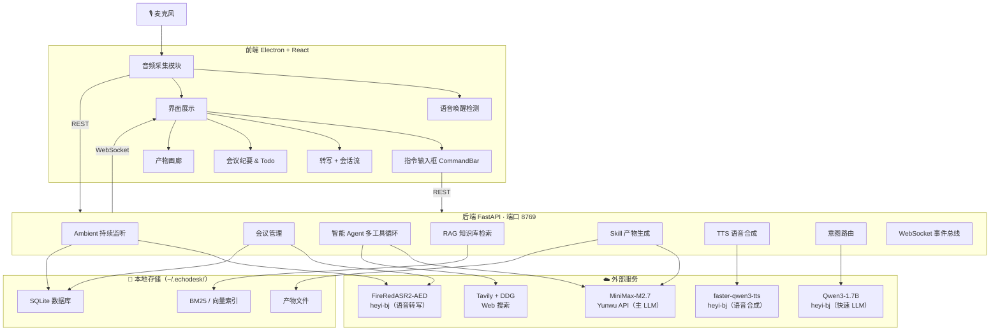
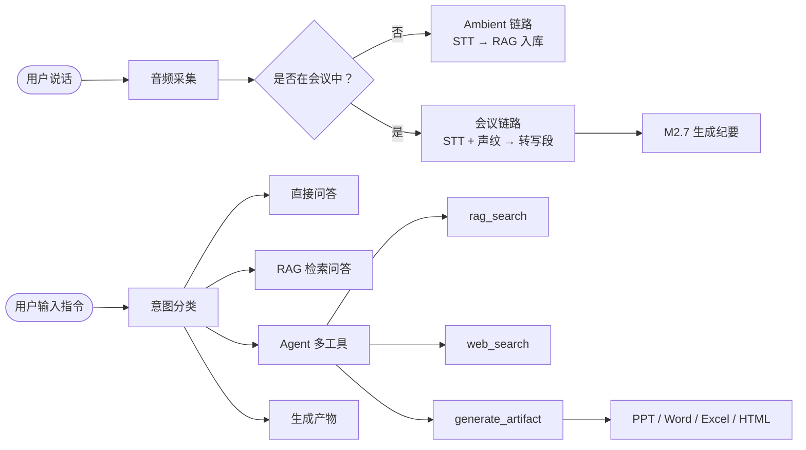

# EchoDesk · 项目介绍

> 个人数字分身桌面应用 · 本地优先，数据不出机

---

## 架构图



---

## 是什么

EchoDesk 是一款运行在 macOS 的 AI 助手桌面应用。它持续监听环境声音，自动记录会议、构建个人知识库，并能通过语音或文字指令完成智能问答、联网搜索、一键生成 PPT / Word / Excel / HTML 等办公产物。

---

## 技术栈

| 层 | 技术 |
|---|---|
| 桌面壳 | Electron 28 |
| 前端 | React 18 · TypeScript · Vite · Zustand |
| 后端 | Python · FastAPI · SQLite |
| 语音转写 | FireRedASR2-AED（heyi-bj） |
| 语音合成 | faster-qwen3-tts（heyi-bj），音色 aiden |
| 主 LLM | MiniMax-M2.7（via Yunwu API） |
| 快速 LLM | Qwen3-1.7B（heyi-bj，本地 GPU） |
| 声纹识别 | SpeechBrain ECAPA-TDNN（本地 CPU） |
| 知识库 | jieba + BM25（默认）/ hnswlib 向量混合检索（可选） |
| Web 搜索 | Tavily（主）+ DuckDuckGo（兜底） |

---

## 核心功能

### 🎙️ Ambient 持续监听
App 启动即开始录音，自动 STT 转写并写入个人知识库，构成环境记忆层，后续问答时可检索。

### 📋 会议管理
支持手动 / 自动触发开会，全程转写 + 说话人声纹分离，结束后 M2.7 自动生成结构化纪要（摘要 + 决议 + 待办清单）。

### 🤖 智能对话 Agent
语音唤醒或文字指令触发，主 LLM 自主串联工具完成复合任务：

```
rag_search   →  检索本地知识库（ambient 转写 + 会议 + 上传文档）
web_search   →  联网搜索（Tavily + DDG）
generate     →  生成产物文件
final_answer →  输出最终回答
```

### 📄 一键产物生成

| 类型 | 风格 |
|---|---|
| **PPT** | Goldman Sachs 投行风：深海军蓝 + 暗金 + serif，含自动目录、章节扉页、hero 数字卡、感谢闭幕页 |
| **Word** | 专业标书风：封面 + 自动 TOC + 编号标题（黑体海军蓝），体裁自适应 |
| **Excel** | 自适应表结构：清单 / 预算 / 对比 / 统计等自动设计 |
| **HTML** | Kami warm-parchment editorial one-pager（暖羊皮纸投行风） |

### 📚 RAG 知识库
支持 PDF / Word / Excel / PPT / HTML / CSV 手动上传，+ 工作区目录自动扫描，+ 会议转写自动入库。默认 BM25 全文检索，可选开启 hnswlib 向量混合检索（RRF 融合）。

### 🔊 TTS 语音播报
Agent 回答后自动合成语音播放，前端顶栏开关控制。

---

## 数据流



---

## 项目结构

```
echo-demo/
├── backend/              FastAPI 后端
│   └── app/
│       ├── api/          路由层（40+ 个接口）
│       ├── use_cases/    业务编排（只依赖 Port 接口）
│       ├── ports/        接口定义
│       └── adapters/     外部实现（LLM / STT / TTS / RAG / Skill…）
├── desktop/              Electron + React 前端
│   └── src/
│       ├── components/   14 个 UI 组件
│       ├── hooks/        5 个业务 hooks
│       ├── store.ts      Zustand 全局状态
│       └── capture/      音频采集 + 路由分发
└── docs/                 PRD · ADR · 安装文档
```

> **架构原则**：`use_cases` 层只依赖 `ports` 接口，不直接引用任何外部 SDK，CI 自动校验依赖规则。

---

## 数据存储（全部本地）

| 数据 | 路径 |
|---|---|
| 数据库 | `~/.echodesk/echodesk.db` |
| 知识库索引 | `~/.echodesk/rag_index/` |
| 产物文件 | `~/.echodesk/skill_build/` |
| Ambient 录音 | `~/.echodesk/ambient/YYYY-MM-DD/` |
| 配置 | `~/.echodesk/config.json` |
| 日志 | `~/.echodesk/logs/runtime.log` |
